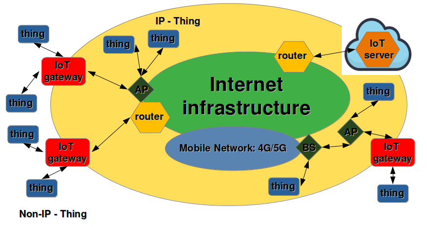
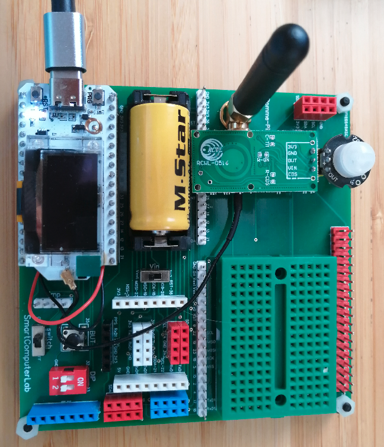
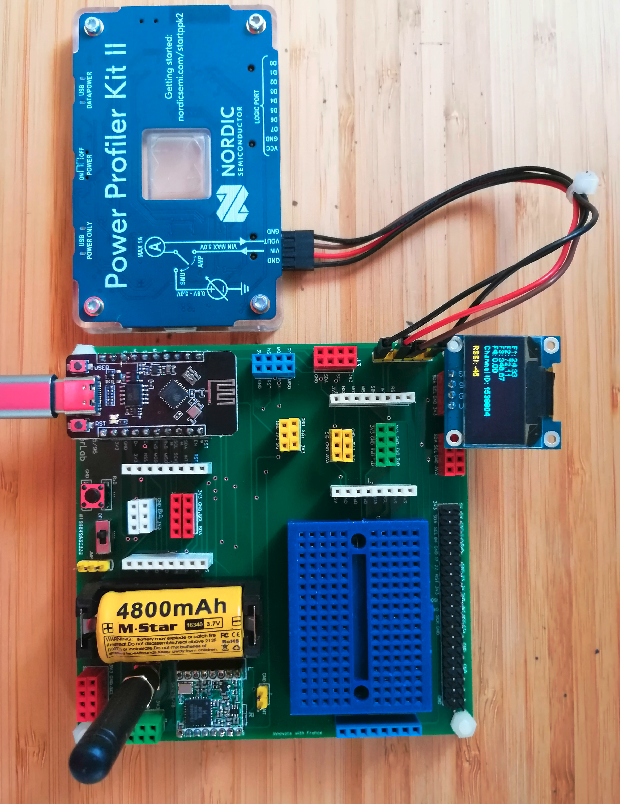
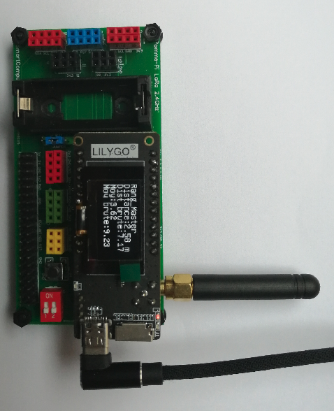

# IoT Architectures including Low-Power-IoT-Architectures
This repository contains the preparaions for IoT (mPython) and Advanced IoT Advanced Laboratories including LoRa/LoRaWAN and Low Power Architectures (C/C++).

<picture>
 
</picture>

+ In the first part of the module we study simple IoT architectures on ESP32(S1) SoC programmed with microPython (3*3 hours).
+ In the second part we experiment with advanced IoT features also on ESP32(S1) programmed with C/C++ (3*3 hours).
+ Finally  we study Low Power LoRa/LoRaWAN architectures on ESP32(C3) and ASR6501/2 CubeCell DevKits (4*3 hours) 
+ The last part of the module is run as small IoT project defined by the students within a volume of 12-15 hours.
This small project may be technology oriented to deepen the understanding of the selected technological aspects or
application oriented in order to develop a complete application.

Low and Very Low Power Architectures are developed and analyzed using new design methodologies based on power profiling with PPK2.
The following is as an example of the screen capture of PPK2.

## Hardware
In this module we use a large number of MCU based boards, sensors/actuators and power profiler tools.
The example boards are:
<picture>
 
</picture>
<picture>
 
</picture>
<picture>
 
</picture>
<picture>
 
</picture>

#
##

